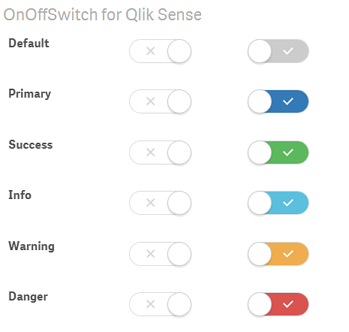
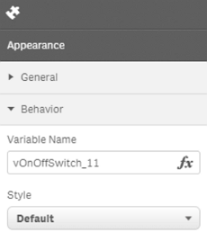

# sense-on-off-switch

> Set a variable in Qlik Sense to true/false using an on-off switch.

<!-- toc -->

* [Screenshot](#screenshot)
* [Installation](#installation)
* [Usage](#usage)
* [Related projects](#related-projects)
* [Contributing](#contributing)
* [Author](#author)
* [License](#license)

_(Table of contents generated by [verb])_

<!-- tocstop -->

## Screenshot

[](#screenshot)

## Installation

1. Download the [latest version](https://github.com/stefanwalther/sense-on-off-switch/raw/master/build/swr-on-off-switch_latest.zip)
2. Qlik Sense Desktop
  - To install, copy all files in the .zip file to folder "C:\Users%USERNAME%\Documents\Qlik\Sense\Extensions\On-Off-Switch"
* Qlik Sense Server
  - See instructions [how to import an extension on Qlik Sense Server](http://help.qlik.com/sense/en-US/online/#../Subsystems/Qlik_Management_Console_help/Content/QMC_Resources_Extensions_AddingExtensions.htm?Highlight=extension)

## Usage

Drag and drop the visualization extension onto a sheet and define

* the name of the variable
* the layout

[](#installation)

### Variable

The variable will not be created by the extension, you have to create the variable in your data load script, e.g.

```bash
SET vOnOffSwitch = 0; // false
or 
SET vOnOffSwitch = 1; // true
```

### Default values

The following variable lower-cased values will be interpreted as false:

* `false`
* `no`
* `0`

whereas

* `true`
* `no`
* `1`

### Values set

If the user switches the on-off switch to false the variable value will be set to `0`, otherwise to `1`.

## Related projects

* [qsmediabox](https://github.com/stefanwalther/qsMediaBox): Include web pages, videos, images and much more into your Qlik Sense app.
* [sense-themable-kpi-tile](https://github.com/stefanwalther/sense-themable-kpi-tile): KPI Tile for Qlik Sense with the ability to use themes or to customize background… [more](https://github.com/stefanwalther/sense-themable-kpi-tile)

## Contributing

Contributing to this project is welcome. The process to do so is outlined below:

1. Create a fork of the project
2. Work on whatever bug or feature you wish
3. Create a pull request (PR)

I cannot guarantee that I will merge all PRs but I will evaluate them all.

## Author

**Stefan Walther**

+ [qliksite.io](http://qliksite.io)
* [twitter/waltherstefan](http://twitter.com/waltherstefan)
* [github.com/stefanwalther](http://github.com/stefanwalther)

## License

Copyright © 2015 Stefan Walther

Released under the MIT license.

***

_This file was generated by [verb-cli](https://github.com/assemble/verb-cli) on July 07, 2015._