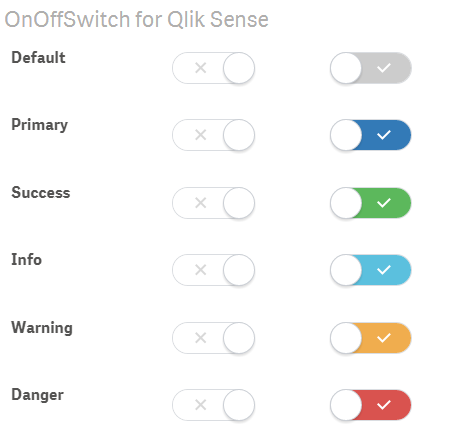

# !!! Work not finished, yet !!!

---

# On Off Switch
> Set a variable in Qlik Sense to true/false by using this On/Off switch.

## Purpose and Description

## Screenshot

## Installation

## Configuration

## Contributing
Contributing to this project is welcome. The process to do so is outlined below:

1. Create a fork of the project
2. Work on whatever bug or feature you wish
3. Create a pull request (PR)

I cannot guarantee that I will merge all PRs but I will evaluate them all.

## Change Log

See [CHANGELOG.md](CHANGELOG.md)

## License & Copyright
The software is made available "AS IS" without any warranty of any kind under the MIT License (MIT).
Since this is a private project QlikTech support agreement does not cover support for this software.

See [Additional license information for this solution.](LICENSE.md)
